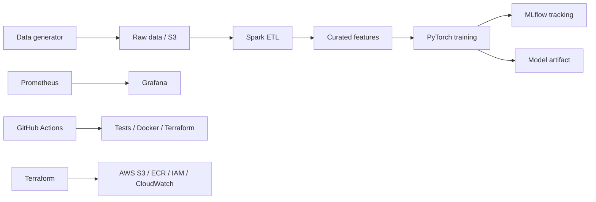

# Big Data ML Platform End-to-End

Projet demo end-to-end pour une plateforme Big Data + Deep Learning:

- ingestion et transformation avec Spark
- entrainement d'un modele deep learning PyTorch
- tracking MLflow
- orchestration locale avec Docker Compose
- monitoring Prometheus + Grafana
- infrastructure AWS avec Terraform
- CI/CD GitHub Actions

## Architecture



## Demo locale rapide

Prerequis:

- Docker et Docker Compose
- Python 3.11 si tu veux lancer les tests hors conteneur

```bash
docker compose up --build
```

Services:

- MLflow: http://localhost:5000
- Spark master UI: http://localhost:8080
- API inference: http://localhost:8000/docs
- Prometheus: http://localhost:9090
- Grafana: http://localhost:3000 avec `admin` / `admin`

Le conteneur `pipeline-demo` genere des donnees, lance un job Spark, entraine un modele PyTorch et enregistre les metriques dans MLflow.

## Commandes utiles

```bash
make demo
make test
make lint
make docker-build
```

Exemple prediction apres `docker compose up --build`:

```powershell
./scripts/predict_example.ps1
```

## Deploiement AWS

Configurer les credentials AWS puis:

```bash
cd infra/terraform
terraform init
terraform plan -var="project_name=bigdata-ml-platform" -var="aws_region=eu-west-1"
terraform apply
```

La CI GitHub Actions contient:

- tests unitaires
- build Docker
- validation Terraform
- plan Terraform sur pull request
- apply Terraform sur `main` si les secrets AWS sont configures

Secrets GitHub attendus:

- `AWS_ACCESS_KEY_ID`
- `AWS_SECRET_ACCESS_KEY`
- `AWS_REGION`
- `AWS_ACCOUNT_ID`

Variables GitHub recommandees:

- `ECR_REPOSITORY` avec le nom du repository ECR Terraform, par exemple `bigdata-ml-platform-dev`

## Structure

```text
.
|-- .github/workflows/ci-cd.yml
|-- apps/training/train_model.py
|-- apps/inference/api.py
|-- data/generate_data.py
|-- infra/terraform
|-- monitoring
|-- spark/jobs/etl_features.py
|-- tests
|-- docker-compose.yml
|-- Dockerfile
|-- Makefile
```

## Initialiser Git et GitHub

```bash
git init
git add .
git commit -m "Initial end-to-end big data ML platform"
git branch -M main
git remote add origin git@github.com:<org>/<repo>.git
git push -u origin main
```
